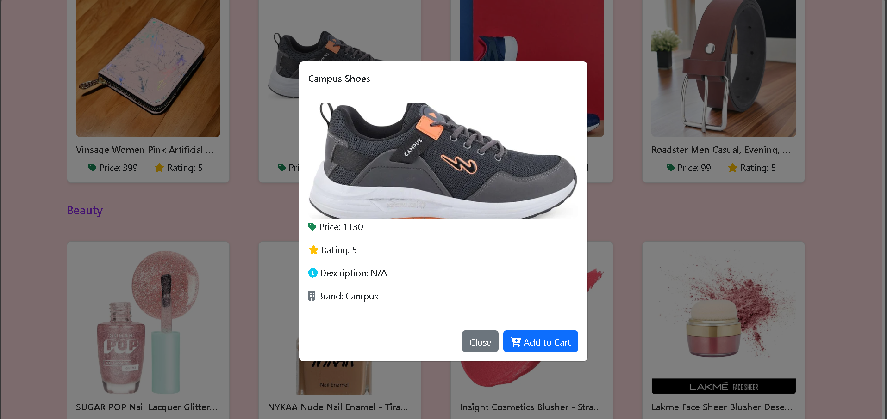
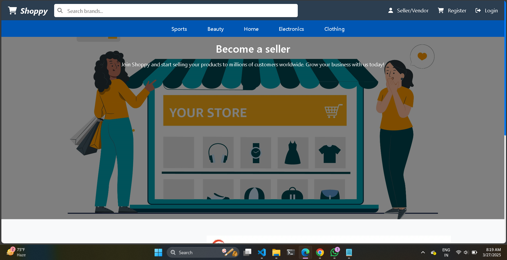
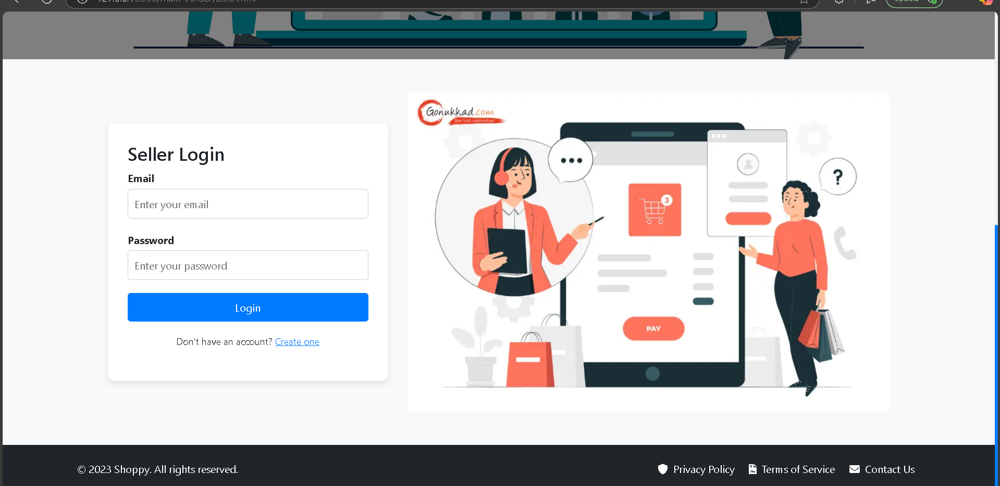

# Multi-Vendor E-Commerce Platform

A complete e-commerce solution with separate interfaces for vendors and customers, built with modern web technologies.

## 🔗 Links
- [Live Demo](https://multi-vendor-eta.vercel.app/index.html)
- [GitHub Repository](https://github.com/RahulkrWD/multi-vendor)

## ✨ Features

### 👨‍💼 Customer Side
- User authentication (login/register/logout)
- Product browsing and search
- Shopping cart functionality
- Checkout process
- Order history tracking
- Profile management

### 👩‍💼 Vendor Side
- Vendor registration and login
- Product management (add/edit/delete)
- Order management
- Profile customization
- Dashboard analytics

## 🛠️ Tech Stack
- **Frontend**: HTML5, CSS3, JavaScript
- **UI Framework**: Bootstrap 5
- **Backend**: Firebase (Authentication, Realtime Database, Storage)
- **Hosting**: Vercel

## 🚀 Quick Start
1. Clone the repo:
   ```bash
   git clone https://github.com/RahulkrWD/multi-vendor.git

   ## 📸 Screenshots

### Customer Interface






### Video presentation link of project
[Video link](https://drive.google.com/file/d/1nmInGK966Vh6OV_9RCP_9dU1Z_Viac1v/view?usp=sharing)


